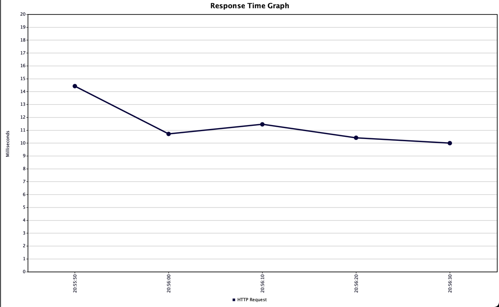
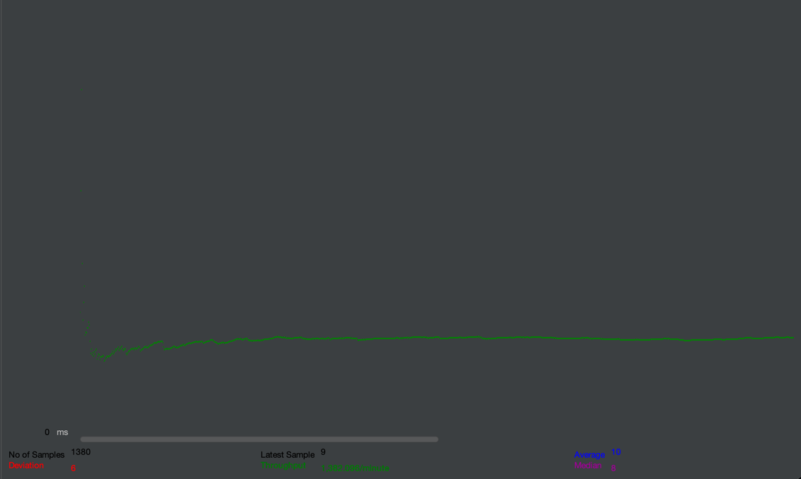
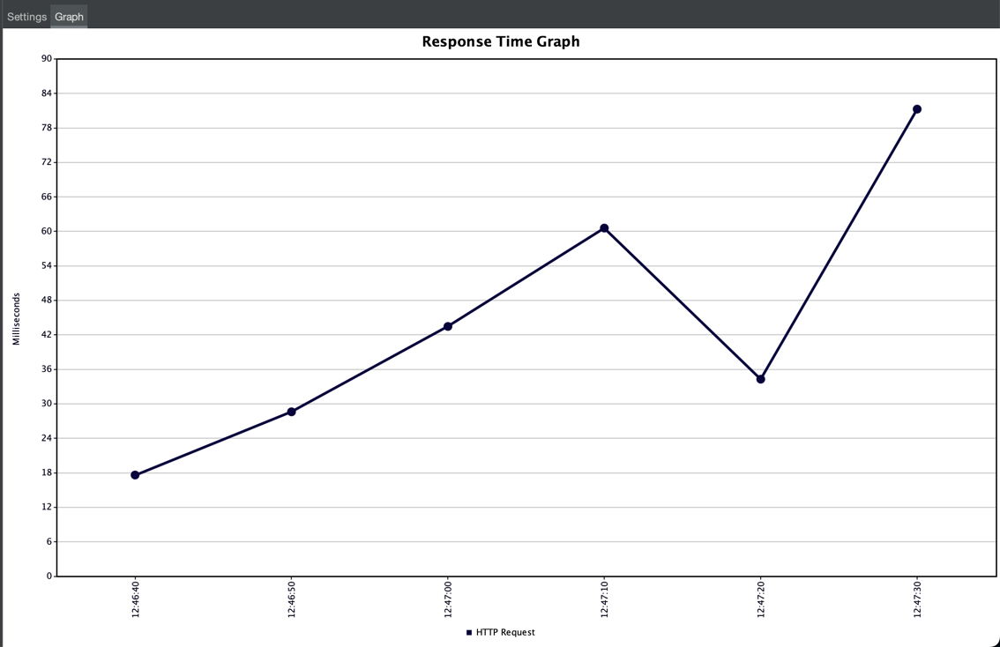
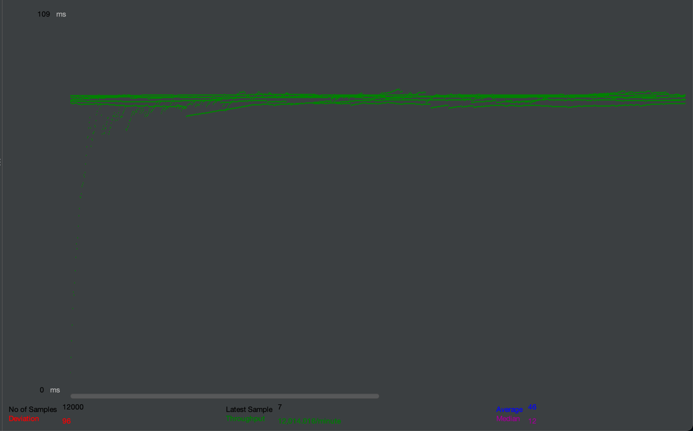

# Домашнее задание 2. Индексы: оптимизация запросов

## Постановка задачи
1. Сгенерировать любым способ 1,000,000 анкет. Имена и Фамилии должны быть реальными (чтобы учитывать селективность индекса) (или воспользовать уже готовым списком).
2. Реализовать функционал поиска анкет по префиксу имени и фамилии (одновременно) в вашей социальной сети (реализовать метод /user/search из спецификации) (запрос в форме firstName LIKE ? and secondName LIKE ?). Сортировать вывод по id анкеты. Использовать InnoDB движок.
3. Провести нагрузочные тесты этого метода. Поиграть с количеством одновременных запросов. 1/10/100/1000.
4. Построить графики и сохранить их в отчет
5. Сделать подходящий индекс.
6. Повторить пункт 3 и 4.
7. В качестве результата предоставить отчет в котором должны быть:
   - графики latency до индекса;
   - графики throughput до индекса;
   - графики latency после индекса;
   - графики throughput после индекса;
   - запрос добавления индекса;
   - explain запросов после индекса;
   - объяснение почему индекс именно такой;

ДЗ принимается в виде отчета по выполненной работе.

## Отчёт
Я проводил замеры на своём ноутбуке. Постгрес поднят в докере, приложение запущено нативно, перед приложением стоит nginx.
Нагружал сервис методом открытой нагрузки в jmeter с конфигом `rate(23/sec) random_arrivals(60 sec)`.
Получил следующие результаты throughput и latency:

23 запроса в секунду -- экспериментально определённое максимальное значение rps, при котором НЕ растёт latency неограниченно, т.е. сервис выдерживает нагрузку.




Запрос на поиск в базе:
```sql
SELECT id,
       user_id,
       password,
       first_name,
       second_name,
       birthdate,
       biography,
       interests,
       city
FROM users
WHERE first_name LIKE 'Иль%'
  AND second_name LIKE 'Абрамов%';
```

План запроса без индекса:
```shell
Gather  (cost=1000.00..27917.10 rows=1 width=123)
  Workers Planned: 2
  ->  Parallel Seq Scan on users  (cost=0.00..26917.00 rows=1 width=123)
        Filter: (((first_name)::text ~~ 'Иль%'::text) AND ((second_name)::text ~~ 'Абрамов%'::text))
```

### Создаём индекс

Запрос на добавление индекса:
```sql
CREATE INDEX users_first_name_second_name_index
ON users (first_name text_pattern_ops, second_name text_pattern_ops);
```

План запроса с индексом:
```shell
Bitmap Heap Scan on users  (cost=234.43..507.01 rows=1 width=123)
  Filter: (((first_name)::text ~~ 'Иль%'::text) AND ((second_name)::text ~~ 'Абрамов%'::text))
  ->  Bitmap Index Scan on users_first_name_second_name_index  (cost=0.00..234.43 rows=71 width=0)
        Index Cond: (((first_name)::text ~>=~ 'Иль'::text) AND ((first_name)::text ~<~ 'Иль'::text) AND ((second_name)::text ~>=~ 'Абрамов'::text) AND ((second_name)::text ~<~ 'Абрамог'::text))
```

Сервис стал выдерживать 200 запросов в секунду достаточно стабильно:



### Объяснение
Индекс создан по двум полям, поскольку фильтрация происходит по двумя полям сразу.
выбран btree индекс с text_pattern_ops ops class-ом, который позволяет эффективно фильтровать по префиксу строки. Это подтверждается замерами, в которых throughput вырос с 23 rps до 200 rps.